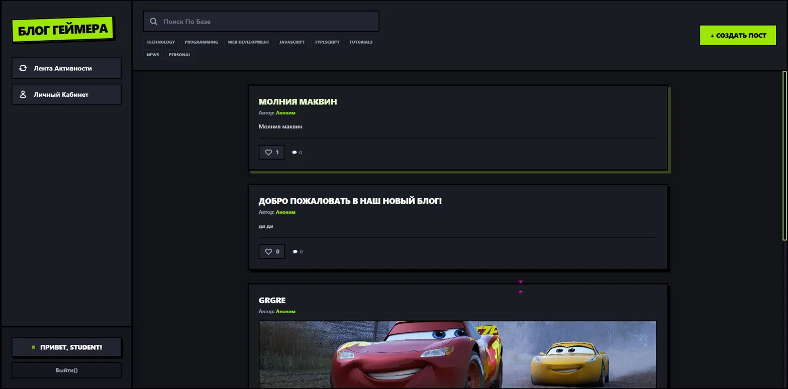

#  Блог Геймера

> Современный блог-платформа с тёмным UI в стиле neobrutalism, построенный на Vanilla TypeScript + Vite + Tailwind CSS v4. Поддерживает авторизацию через JWT, посты с изображениями, комментарии, лайки и панель администратора.
<p align="center">
  
</p>
---

## Содержание

- [Стек технологий](#стек-технологий)
- [Структура проекта](#структура-проекта)
- [Быстрый старт](#быстрый-старт)
- [Переменные окружения / Конфигурация](#конфигурация)
- [Функциональность](#функциональность)
- [API](#api)
- [Тестовые аккаунты](#тестовые-аккаунты)
- [Известные особенности](#известные-особенности)

---

## Стек технологий

| Инструмент | Версия | Назначение |
|---|---|---|
| TypeScript | ~6.0.2 | Основной язык |
| Vite | ^8.0.12 | Сборщик и dev-сервер |
| Tailwind CSS | ^4.3.0 | Стилизация |
| Vanilla JS/TS | — | Без фреймворков |

---

## Структура проекта

```
├── Server/                  # Серверная часть (отдельный проект)
├── src/
│   ├── api/
│   │   └── api.ts           # Сервисный слой — все запросы к серверу
│   ├── core/
│   │   └── app.ts           # Главный класс приложения BlogApp
│   ├── data/
│   │   └── db.ts            # Локальное in-memory хранилище (DB)
│   ├── types/
│   │   └── types.ts         # TypeScript интерфейсы (PostDTO, UserDTO и др.)
│   ├── views/
│   │   └── templates.ts     # HTML-шаблон приложения (getAppTemplate)
│   ├── main.ts              # Точка входа
│   └── style.css            # Глобальные стили + Tailwind
├── index.html               # Корневой HTML
├── package.json
├── tsconfig.json
└── vite.config.ts
```

---

## Быстрый старт

### Требования

- **Node.js** >= 20.19.0 или >= 22.12.0
- **npm** >= 9

### 1. Клонировать репозиторий

```bash
git clone https://github.com/your-username/gamer-blog.git
cd gamer-blog
```

### 2. Установить зависимости

```bash
npm install
```

### 3. Запустить сервер (бэкенд)

Сначала поднимите серверную часть из папки `Server/`. Сервер должен быть доступен по адресу:

```
http://localhost:8083
```

> Без запущенного сервера приложение будет работать, но посты не будут загружаться с бэкенда.

### 4. Запустить фронтенд в режиме разработки

```bash
npm run dev
```

Откройте браузер по адресу: **http://localhost:5173**

### 5. Сборка для продакшена

```bash
npm run build
```

Скомпилированные файлы окажутся в папке `dist/`.

### 6. Превью продакшен-сборки

```bash
npm run preview
```

---

## Конфигурация

Базовый URL сервера прописан в `src/api/api.ts`:

```typescript
private baseUrl = 'http://localhost:8083/api';
```

Если ваш сервер запущен на другом порту — измените это значение.

---

## Функциональность

###  Авторизация
- Вход по логину и паролю (JWT-токен сохраняется в `localStorage`)
- Регистрация новых пользователей
- Автоматическое восстановление сессии при перезагрузке страницы
- Автоматический рефреш JWT при истечении токена

###  Посты
- Просмотр ленты постов (с поиском и фильтрацией по категориям)
- Создание поста с заголовком, текстом и изображением
- Редактирование и удаление своих постов (для админа — любых)
- Изображения хранятся в `localStorage` в формате base64 (сервер не сохраняет изображения)

###  Комментарии
- Добавление комментариев к постам (только авторизованным)
- Удаление комментариев (только для администратора)
- Счётчик комментариев обновляется в реальном времени без перезагрузки

###  Лайки
- Лайк / снятие лайка на пост
- Счётчик обновляется мгновенно

###  Поиск и фильтрация
- Поиск по заголовку и тексту поста с подсветкой совпадений
- Фильтрация по категориям (тэги над лентой и бейджи на постах)

###  Панель администратора
- Управление пользователями: бан/разбан с указанием причины
- Управление постами: редактирование и удаление любых постов

###  Личный кабинет
- Отображение имени, роли и количества постов пользователя
- Счётчик постов обновляется сразу после публикации/удаления

---

## API

Фронтенд взаимодействует с сервером через `src/api/api.ts`. Базовый URL: `http://localhost:8083/api`.

### Аутентификация

| Метод | Endpoint | Описание |
|---|---|---|
| `POST` | `/users/auth` | Вход (возвращает JWT) |
| `PUT` | `/users` | Регистрация |
| `PUT` | `/keys` | Получение API-ключа |

### Посты

| Метод | Endpoint | Описание |
|---|---|---|
| `POST` | `/posts/getall` | Получить список постов (с пагинацией) |
| `GET` | `/posts/:id` | Получить пост по ID |
| `PUT` | `/posts` | Создать пост |
| `POST` | `/posts/:id` | Обновить пост |
| `DELETE` | `/posts/:id` | Удалить пост |
| `POST` | `/posts/:id/likes` | Поставить/снять лайк |

### Комментарии

| Метод | Endpoint | Описание |
|---|---|---|
| `PUT` | `/posts/comments` | Добавить комментарий |
| `DELETE` | `/posts/comments/:id` | Удалить комментарий |

### Категории

| Метод | Endpoint | Описание |
|---|---|---|
| `GET` | `/categories` | Получить все категории |

### Пользователи

| Метод | Endpoint | Описание |
|---|---|---|
| `POST` | `/users/:id/ban` | Заблокировать пользователя |

### Заголовки запросов

```
X-API-Key: <ключ из /keys>
Authorization: Bearer <JWT токен>
Content-Type: application/json
```

---

## Тестовые аккаунты

Локальные аккаунты (из `src/data/db.ts`) — используются только для восстановления сессии. Авторизация происходит через сервер.

| Логин | Пароль | Роль |
|---|---|---|
| `admin` | `123` | Администратор |
| `user1` | `123` | Пользователь |
| `user2` | `123` | Пользователь |

> Администратор имеет доступ к «Панели Разработчика» и может управлять постами и пользователями.

---

## Известные особенности

**Изображения в постах**
Сервер не хранит изображения — они сохраняются в `localStorage` браузера в формате base64. Это означает:
- Картинки видны только в том браузере, где был создан пост
- При очистке `localStorage` картинки пропадут
- Большие изображения могут переполнить `localStorage` (лимит ~5 МБ)

**Удалённые посты**
ID удалённых постов хранятся в `localStorage` под ключом `blog_deleted_post_ids`. Это нужно, чтобы посты, удалённые через фронтенд, не появлялись снова при перезагрузке (если сервер продолжает их возвращать).

**Роли пользователей**
Роль `admin` определяется по логину: если логин === `'admin'`, пользователь получает права администратора. Это поведение можно изменить в методе `handleAuthSubmit` в `src/core/app.ts`.

---

## Скрипты

```bash
npm run dev       # Запуск dev-сервера (Vite)
npm run build     # TypeScript-компиляция + сборка
npm run preview   # Превью продакшен-сборки
```

---

## Лицензия

MIT
